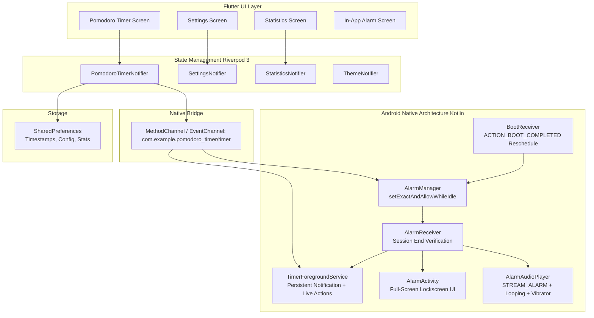

# Implementation Plan - Production-Ready Flutter Pomodoro Timer Android Application

A comprehensive architectural blueprint and implementation roadmap for the production-ready Pomodoro Timer Android application.

---

## 1. Architectural Blueprint

---

## 2. Key Technical Design Decisions

### 1. Robust Background & Doze Survival
- **Problem**: Standard Dart `Timer.periodic` pauses when the app is minimized, CPU enters deep sleep, or device enters Android Doze mode.
- **Solution**:
  1. **Foreground Service**: Android native `TimerForegroundService` keeps the process alive with an ongoing notification showing session name, formatted remaining time, and instant action buttons (Pause, Resume, Reset, Skip).
  2. **Exact Session-End Alarm**: Native `AlarmManager.setExactAndAllowWhileIdle()` is scheduled for the exact `sessionEndsAt` timestamp. Even in deep Doze mode, Android wakes up the device to execute `AlarmReceiver`.
  3. **Timestamp-Based Math**: The countdown time is never computed purely by ticking a counter. Instead, we persist `sessionStartedAt` and `sessionEndsAt`. At any millisecond, $\text{remainingTime} = \max(0, \text{sessionEndsAt} - \text{currentTime})$. When the app resumes or process restarts, state recovers with zero drift.

### 2. Session-End Alarm & Full-Screen UI
- **Audio Output**: Android `AudioAttributes.USAGE_ALARM` / `AudioManager.STREAM_ALARM` with audio focus request, ensuring the alarm sounds at alarm volume even if media or notification volume is muted.
- **Continuous Looping**: Loops until the user taps "Stop Alarm" in the notification or on the full-screen UI.
- **Full-Screen Lockscreen Activity**: Native `AlarmActivity` with `setShowWhenLocked(true)`, `setTurnScreenOn(true)`, and `FLAG_KEEP_SCREEN_ON` pops over the keyguard if the phone is locked when the timer completes, displaying the time's up banner, completed session info, and dismiss button.

### 3. Bundled PCM Audio
- Provide 5 bundled tones (`classic`, `digital`, `bell`, `soft`, `alarm`) both in `assets/audio/` and `android/app/src/main/res/raw/` for zero-latency background native playback.
- Sound previewing in Settings uses native `MediaPlayer` to guarantee exact volume and tone parity.

### 4. Modern Android Permissions (Android 12 to 15+)
- `POST_NOTIFICATIONS` (Android 13+ runtime prompt)
- `SCHEDULE_EXACT_ALARM` & `USE_EXACT_ALARM` (Android 12+)
- `FOREGROUND_SERVICE` & `FOREGROUND_SERVICE_SPECIAL_USE` (Android 14+ FGS type enforcement)
- `USE_FULL_SCREEN_INTENT` (Full-screen lockscreen alarms)
- `WAKE_LOCK`, `VIBRATE`, `RECEIVE_BOOT_COMPLETED`
- Battery Optimization helper directing users to system whitelist settings.

---

## 3. Component Breakdown

### Android Native Layer (`android/app/src/main/`)
1. **`AndroidManifest.xml`**: Declares all permissions, foreground service with subtype, receivers, and `AlarmActivity`.
2. **`TimerForegroundService.kt`**: Persistent countdown notification on channel `pomodoro_timer_channel` with quick action buttons.
3. **`AlarmReceiver.kt`**: Triggered by exact alarm, acquires `WakeLock`, verifies timestamp integrity, starts audio, and dispatches full-screen intent.
4. **`AlarmActivity.kt`**: Lockscreen-aware activity (`setShowWhenLocked(true)`, `setTurnScreenOn(true)`), modern UI with "STOP ALARM".
5. **`AlarmAudioPlayer.kt`**: `MediaPlayer` on `AudioAttributes.USAGE_ALARM` with looping and synchronized `Vibrator` loop.
6. **`BootReceiver.kt`**: Reschedules active alarms if the phone reboots.
7. **`MainActivity.kt`**: Handles `MethodChannel` and `EventChannel` for timer controls and notification action events.

### Flutter Presentation & State Layer (`lib/`)
1. **Models**:
   - `pomodoro_state.dart`: Immutable state with phase enum, time formatting, and progress calculation.
   - `pomodoro_settings.dart`: User preferences with 1–120 min duration validation.
   - `daily_statistics.dart`: Daily focus minutes and completed cycle tracking.
2. **Services**:
   - `storage_service.dart`: `SharedPreferences` persistence for state, settings, and 7-day stats.
   - `native_timer_service.dart`: MethodChannel/EventChannel bridge to Android Kotlin.
   - `audio_service.dart`: Tone preview dispatcher.
3. **Riverpod 3 State Management**:
   - `pomodoro_provider.dart`: Core timer state machine, ticker, and lifecycle handlers.
   - `settings_provider.dart`: Riverpod settings notifier.
   - `statistics_provider.dart`: Riverpod 7-day statistics notifier.
   - `theme_provider.dart`: Dynamic light/dark theme notifier.
4. **UI Screens & Widgets**:
   - `pomodoro_screen.dart`: Main dashboard with circular timer, phase badge, battery banner, and control buttons.
   - `circular_timer_painter.dart`: Custom canvas painter with phase-specific gradients and tick marks.
   - `alarm_dialog.dart`: In-app alert modal when timer finishes in foreground.
   - `settings_screen.dart`: Duration sliders, sound selector with preview, and battery whitelist helper.
   - `statistics_screen.dart`: 7-day visual bar chart, streak, and focus minutes breakdown.

---

## 4. Verification & Testing Strategy

### Automated Unit Tests (`test/pomodoro_test.dart`)
1. **State Immutability & Padding**: Tests `formattedRemainingTime` (`mm:ss`) and `progress` calculation.
2. **Bounds Validation**: Clamps durations strictly between 1 and 120 minutes.
3. **JSON Serialization**: Full round-trip testing of settings and statistics.
4. **Drift & Recovery Math**: Mathematical verification that `remainingSeconds = sessionEndsAt - now` recovers correctly across process kills.
5. **Cycle Transitions**: Work $\to$ Short Break $\to$ Work $\dots \to$ Long Break after configured cycle count.

### Build Verification
1. `flutter analyze`: Zero warnings, zero errors.
2. `flutter test`: 11/11 tests passing.
3. `flutter build apk --debug`: Assembled successfully (~158 MB debug build).
4. `flutter build apk --release`: Assembled successfully (~20-30 MB optimized release build).
